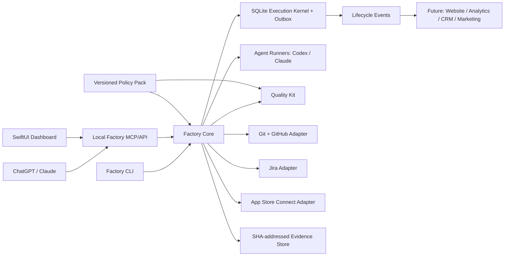

# App Factory V1 Master Plan

Status: superseded as an implementation plan; retained as the legacy-system audit  
Superseded by: `/Users/pchordia/code/factory/app-factory/docs/roadmap/BUILD_STAGES.md`  
Created: 2026-08-10  
Primary pilot: Hindsight  
Primary implementation repository: `wip_apps/core_apps/orchestrator`  
Canonical target source root: `/Users/pchordia/code`  

## 1. Decision

Build the Factory, but do not rebuild the existing orchestrator from scratch.

The current Python orchestrator already contains valuable execution machinery: local Codex and Claude runners, resumability, process control, locks, ledgers, checkpoints, worktree support, verification, incident recording, and a SwiftUI control surface. It becomes **Factory Core**. It is not yet the finished App Factory because it lacks a durable issue-execution kernel, production Jira/GitHub/App Store Connect adapters, fail-closed release certification, and restart-safe reconciliation of external effects.

The system will be built and proved in vertical slices. Hindsight is the first product to reach a clean, SHA-bound Internal TestFlight through the Factory. A second app proves that the Factory is reusable rather than Hindsight-specific.

This is worth doing if it is treated as a product-delivery system, not as a collection of AI prompts or a large dashboard. The first return on the investment is a repeatable Jira-issue-to-verified-PR loop. The second is a repeatable verified-commit-to-TestFlight loop. Marketing, CRM, website, analytics, and social automation plug into the same event model only after those two loops are reliable.

## 2. Factory V1 outcome

Factory V1 is complete only when all of the following are true:

1. A project can be registered from a typed project manifest without hand-editing tool-specific rule files.
2. A chat command or local CLI command can start or resume project execution.
3. The scheduler claims one eligible Jira issue at a time, creates an isolated worktree and branch, invokes a coding agent, verifies the result independently, opens or updates a draft pull request, and updates Jira.
4. Killing and restarting the Factory does not lose work or duplicate branches, pull requests, Jira comments, build numbers, or uploads.
5. The five preselected Hindsight issues complete through that loop without manual redispatch.
6. The whole Hindsight experience passes a fail-closed product-quality profile, including visual coherence, deterministic journeys, accessibility checks, and regression evidence.
7. The exact clean Git SHA that passed certification is archived, exported, uploaded, processed by App Store Connect, installed from Internal TestFlight, smoke-tested, and recorded in a release certificate.
8. A second existing app is onboarded without modifying Factory Core.
9. Codex, Claude, Cursor, and other coding clients receive generated tool-specific instructions from one versioned policy source, and CI verifies that generated files have not drifted.

Anything less is an intermediate milestone, not “autonomous app delivery.”

## 3. Operator experience

### 3.1 First project

The intended experience is:

1. Open ChatGPT/Codex or Claude and say: “Plan and register Project X.”
2. The client calls the local Factory service.
3. Factory interviews only for unresolved product decisions, then generates a project manifest, product contract, proposed Jira epics/issues, repository plan, quality profile, and provisioning diff.
4. The operator reviews one bounded plan and approves external resource creation.
5. Factory idempotently creates or connects the GitHub repository and Jira project, installs the policy pack, creates the backlog, and reports the first executable issue.
6. The operator says: “Start Project X.” The command persists `desired_state=running` and returns; it does not require the chat or terminal to remain open.
7. A singleton macOS user LaunchAgent owns the local scheduler. It executes unblocked issues, opens pull requests, runs checks, records findings, and pauses only at explicit human gates.
8. The dashboard and chat show the same persisted state; neither is the source of truth.
9. When the release profile passes, Factory requests approval for Internal TestFlight promotion.
10. Factory uploads the certified SHA, waits for processing, assigns the build to the internal group, and produces an install-and-smoke-test checklist or executes automatable parts.

### 3.2 Normal daily use

The operator should not manually create a Jira project for every idea. Normal commands are:

```text
factory project plan --from-chat <spec>
factory project apply <plan-id>
factory run --project hindsight
factory status --project hindsight
factory pause --project hindsight
factory resume --project hindsight
factory promote --project hindsight --target internal-testflight
factory audit --all-projects
factory sync jira --project hindsight
```

ChatGPT, Claude, the SwiftUI dashboard, and future buttons call the same commands through a local service/MCP interface. A dashboard action is never unique business logic.

The honest local-first limit is that work stops while the Mac is asleep, shut down, logged out, or unavailable behind FileVault after a restart. Truly unattended overnight work requires an always-on, logged-in Mac configured for that purpose. Closing the initiating chat or terminal must not stop work.

### 3.3 Adding a feature to an enrolled app

The operator may begin in Codex desktop or a supported Claude local client and say: “Add Feature Y to Hindsight.” The client does not implement directly from that sentence. It asks only for unresolved product choices, reads the registered project and current Jira/GitHub state, and produces a dry-run feature plan containing:

- Product outcome, scope, non-goals, and acceptance criteria.
- Affected screens, states, data, privacy, analytics, migrations, and release risk.
- Proposed Jira epic/issues and their dependencies.
- Required deterministic, visual, accessibility, and regression evidence.
- The exact external mutations requiring approval.

After approval, the issues enter Jira. The LaunchAgent claims eligible issues, executes them through clean mirrors/worktrees, opens and verifies pull requests, and pauses at the configured merge or release gates. The operator reviews the diff, screenshots, journey filmstrip, and live/supervised simulator run from chat or the dashboard. A spoken or typed bug observation becomes a structured finding tied to the task, SHA, screen, and evidence timestamp; it does not disappear into chat history.

The scheduler remains independent of the chat. A generic remote browser chat is not assumed to reach localhost; V1 validates Codex desktop/local CLI and supported Claude CLI/desktop MCP transports first.

### 3.4 Enrolling an existing app

An existing app does not need to be rewritten into a Factory template. Enrollment is an adapter-and-gap process:

```text
factory enroll plan --repo <path> --jira <key>
factory enroll apply <plan-hash>
factory verify --project <slug> --profile enrollment
```

`enroll plan` is read-only. It inventories Git state, remote, build/test commands, platform/toolchain, architecture, current instructions, Jira/GitHub/Apple identifiers, routes/screens, quality evidence, secrets risk, and policy conflicts. It classifies the project as:

- `native`: already satisfies the minimum contracts.
- `adaptable`: can be enrolled by adding manifests, generated instructions, command adapters, and missing checks.
- `blocked`: needs an explicit product decision, credential, repository repair, or destructive migration before automation.

`enroll apply` adds only the approved compatibility layer: `ProjectManifest`, immutable policy lock, generated agent entrypoints, quality/experience manifests, safe command definitions, and CI/Factory adapters. Existing architecture and build tooling remain authoritative unless a separate migration is approved. Enrollment initially grants planning and read-only verification; autonomous writes and release promotion remain disabled until their profiles pass.

### 3.5 Canonical local source layout

```text
/Users/pchordia/code/
├── apps/          # iOS and other product repositories
├── factory/       # Factory Core, rules, and integrations
├── websites/      # portfolio and product websites
├── shared/        # reusable packages proven across products
├── templates/     # project templates and generators
├── incubator/     # uncommitted ideas and experiments
└── archive/       # explicitly retired/read-only projects
```

Runtime databases, logs, mirrors, derived data, and large evidence do not live beside source repositories. Factory-managed runtime state uses a dedicated application-support location and stores only references/digests in project Git repositories.

Existing repositories are migrated through `relocate plan/apply`, never a blind filesystem move. The operation verifies remotes and SHAs, checkpoints approved WIP, creates or clones the destination, reproduces and validates uncommitted changes where applicable, runs the project baseline, updates the registry atomically, and retains the old copy until the new path is proven. Hindsight and Factory Core require separate WIP approvals before relocation because both currently contain local changes.

## 4. Scope and sequencing

### 4.1 V1 includes

- Local-first execution on the Mac.
- One durable scheduler and execution-attempt state machine reconciled with Jira.
- Jira as the human-readable work queue and planning surface.
- Git/GitHub as source, review, and code-history authority.
- Isolated worktrees and short-lived issue branches.
- Codex and Claude runner adapters behind one agent interface.
- Fail-closed product and release verification.
- Hindsight Internal TestFlight delivery.
- Project registration and onboarding.
- One policy source with generated adapters for each coding tool.
- Structured findings and controlled lesson promotion.
- CLI first, then MCP/chat access, then adaptation of the existing SwiftUI GUI.

### 4.2 Explicitly deferred until the delivery loop works

- Autonomous public App Store release.
- Paid advertising execution or automatic spend changes.
- Fully autonomous social posting.
- CRM selection and multi-product sales automation.
- Website idea submission and voting.
- Cross-product analytics dashboard.
- SEO/AEO content engine.
- A marketplace of common app modules.

The architecture reserves event hooks for these capabilities. Deferral prevents marketing and dashboard work from hiding an unreliable build/release core.

Factory V1 requires M0 through M9. Reusable product modules (`C9.*`) and the business automations in Section 15 are post-V1 increments.

## 5. Existing assets and their roles

| Asset | V1 role | Required treatment |
|---|---|---|
| Existing orchestrator repository | Factory Core execution substrate | Extend in place through isolated branches/worktrees; preserve the current uncommitted `config.yaml` change |
| `iOS_app_factory_rules` | Versioned policy and certification authority | Add schemas, executable certification profiles, immutable locks, and generated client adapters |
| Hindsight | First end-to-end pilot | Preserve its large dirty working tree, freeze one product authority, then certify a clean candidate SHA |
| Jira `OR` | Factory program and cross-product work | Store Factory epics, shared infrastructure, and cross-project initiatives |
| Jira `HIND` | Hindsight product backlog | Correct inherited field configuration, then create small linked issues |
| GitHub | Code review and CI authority | One PR per issue or coherent small issue group; checks and evidence linked back to Jira |
| App Store Connect | Build and release authority | Treat build number and upload as at-least-once effects requiring lookup and reconciliation |
| Existing SwiftUI orchestrator GUI | Future control surface | Adapt only after the command service and read model are stable |
| Wiped `iOS-App-Factory` workspace | Known-bad evidence corpus | Leave untouched; use selected historical artifacts as regression fixtures, never as active source |

## 6. Sources of truth

Every datum has exactly one authority:

| Concern | Authority |
|---|---|
| Source code and product contracts | Git repository |
| Universal rules and schemas | Rules repository, pinned by commit and digest |
| Human planning and issue status | Jira |
| Runtime leases, retries, events, and pending side effects | Local SQLite execution kernel |
| Pull requests and CI status | GitHub |
| Build processing and tester availability | App Store Connect |
| Credentials | macOS Keychain or approved secret store |
| Evidence | SHA-addressed local artifact store with atomic immutable writes; release certificates and indexes also exported to a configured durable backup; selected summaries linked from GitHub/Jira |
| Dashboard | Read-only projection plus commands; never an independent database |

The Factory reconciles these authorities. It does not silently copy one system’s mutable state into another and hope they remain consistent.

Jira remains authoritative for human issue states such as `Ready`, `In Progress`, `Blocked`, and `Done`. SQLite stores a revision-pinned mirror plus `ExecutionAttempt` states such as `leased`, `running`, `checking`, `waiting_external`, `succeeded`, and `failed`; it is not a second product backlog. A project-specific mapping defines legal Jira transitions. If Jira changes while an attempt is leased, the Factory stops at a safe boundary, compares the stored Jira revision and normalized task digest, and re-plans or blocks instead of overwriting the human change. Jira becomes `Done`, and dependents become eligible, only after merge and post-merge verification reconcile successfully.

## 7. Target architecture



### 7.1 Core modules

1. **Command service** — one typed command surface used by CLI, MCP, and GUI.
2. **Execution kernel** — SQLite migrations, revision-pinned Jira mirrors, execution-attempt states, leases, heartbeats, retry budgets, approvals, event log, operation IDs, and outbox.
3. **Scheduler** — claims only eligible tasks and respects project/global concurrency limits.
4. **Executor** — creates an isolated worktree, invokes an agent with scoped context, runs deterministic checks, requests independent review, and packages evidence.
5. **Adapters** — Jira, GitHub, App Store Connect, local Git, and agent providers. Each adapter supports plan/apply/reconcile semantics.
6. **Quality Kit** — reusable compile, test, journey, visual, accessibility, security, privacy, and product-coherence gates.
7. **Policy compiler** — validates the canonical policy and generates `AGENTS.md`, `CLAUDE.md`, Cursor rules, Codex skills/instructions, and CI checks.
8. **Evidence and learning** — structured findings bound to task, commit, tool version, and artifacts; promotions require regression proof.

External effects move through `planned`, `sent`, `observed`, `confirmed`, `unknown`, or `manual_intervention`. An idempotency key is necessary but is not assumed to be honored by a provider. Reconciliation uses provider-specific correlations: repository plus head branch plus task marker for a pull request; a stable Factory marker for Jira comments and links; bundle/version/build for Apple builds; and an App Store Connect lookup after an upload timeout before any retry.

### 7.2 Technology decision

Keep the existing Python implementation and SwiftUI GUI. Do not introduce a second TypeScript orchestration backend. Use SQLite locally and standard library code where practical. Introduce a small local HTTP/MCP boundary only after the command layer is tested. The existing debate/planning machinery may help create plans and review decisions, but it must not remain the unit that writes an entire app in one opaque run.

Chat sessions are clients, not the background worker. A launchd-managed local Factory daemon owns leases, execution, recovery, and reconciliation. Codex, Claude, the CLI, and the GUI submit commands and may disconnect without stopping the run. The LaunchAgent has singleton ownership, stable state/log locations, a health check, graceful shutdown, wake reconciliation, and child-process-group cleanup. The service binds only to a Unix socket or authenticated loopback interface by default; it is never exposed to the LAN or internet merely for convenience, and approval endpoints are never placed behind an untrusted remote bridge.

Model subscriptions are replaceable execution capacity, not architectural dependencies. Before enabling unattended use, each provider adapter must verify that the chosen local CLI/authentication mode and intended use comply with the provider’s current terms, quotas, and billing. If a normal chat surface cannot call a local tool, the operator uses its local desktop/CLI surface; the Factory must not depend on keeping a browser chat open.

### 7.3 Resume semantics

“Resume” has three separate meanings:

1. `factory resume` changes the scheduler’s persisted desired state from paused to running.
2. Attempt recovery reconciles the worktree, diff, process identity, fence token, and durable phase checkpoints such as `prepared`, `agent_running`, `agent_exited`, `verified`, `committed`, and `effects_pending`.
3. Provider-session resume is an optional optimization. Claude/Codex conversation history is never authoritative or required; when safe continuation cannot be proved, the Factory starts a fresh provider session from `TaskSpec`, Git, policy, and stored evidence.

SQLite, Git, typed contracts, and raw evidence own recovery state. A model’s memory does not.

## 8. Autonomy contract

### 8.1 Actions the Factory may take automatically

- Read project repositories, rules, Jira, GitHub, and App Store Connect state.
- Create isolated local worktrees and issue branches.
- Edit code and documentation inside the claimed task scope.
- Run builds, tests, simulators, linters, screenshots, and local analysis.
- Commit task-scoped changes and push issue branches after configured checks pass.
- Open or update draft pull requests through stable operation markers and reconciliation.
- Add factual Jira comments, evidence links, and status transitions configured for the project.
- Retry transient failures within the task’s budget.
- Stop a failed task and continue unrelated eligible work.
- Resume after process or machine restart.

### 8.2 Explicit human gates

1. Ratifying or materially changing the product authority and scope.
2. Creating external accounts, repositories, Jira projects, domains, paid resources, or credentials unless an already approved provisioning plan covers them.
3. Accepting any visual-baseline creation or change for a product generation.
4. Approving an exception, waiver, destructive migration, privacy-sensitive behavior, or security-risk acceptance.
5. Promoting to Internal TestFlight unless a separately approved, scoped, expiring, and revocable standing authorization covers that exact class of promotion.
6. Adding external testers, submitting for public App Review, releasing publicly, spending money, or publishing marketing content.

### 8.3 Non-negotiable safety rules

- One writer owns a worktree and branch at a time.
- Worktree isolation is mandatory for autonomous code tasks.
- A coding agent cannot approve its own release evidence.
- Coding agents receive a sanitized environment with no Jira, GitHub, App Store Connect, or signing credentials. Network access is denied by default, repository input is treated as untrusted, filesystem allowlists are symlink-safe, and only the command broker may perform external effects.
- A normal coding task cannot edit policy locks, CI workflows, quality/test harnesses, visual baselines, thresholds, signing scripts, or release scripts. Those paths require a separate high-risk task and hash-bound approval.
- Agents cannot weaken tests, quality thresholds, baselines, or waivers merely to pass.
- Missing evidence is a failure, not a warning.
- Maximum automatic attempts default to three; repeated failure becomes a structured blocker.
- External actions use idempotency keys plus an outbox and reconciliation before retry.
- Every claim receives a monotonically increasing fencing token. Commit, push, Jira, GitHub, signing, and release operations reject stale tokens.
- The scheduler never operates on an uncommitted user working tree.
- Every completion is bound to an exact Git SHA.
- Secrets never enter prompts, logs, Jira, commits, screenshots, or artifact bundles.
- Natural-language assent is not sufficient authorization for a governed mutation. The approved plan/diff/SHA and approval record must match at execution time.

## 9. Lifecycle and branch model

### 9.1 Project lifecycle

```text
idea -> discovery -> planned -> provisioned -> building -> verifying
     -> release-candidate -> internal-testflight -> beta -> public-release -> maintain
```

These are durable project states with required entry evidence. They are not inferred from a branch name.

### 9.2 Task lifecycle

```text
proposed -> ready -> leased -> implementing -> verifying -> review-ready
         -> pull-request -> merged -> done
                    \-> blocked
                    \-> retryable
                    \-> cancelled
```

Every transition has typed preconditions and emits an append-only event.

### 9.3 Branch policy

Do not use permanent `dev`, `qa`, `testflight`, and `release` branches as environment databases. They drift, require repeated merges, and make it possible to test a different commit than the one released.

Target policy:

- `main`: protected and releasable.
- `factory/<jira-key>-<slug>`: short-lived issue branch in an isolated worktree.
- `release/<version>`: optional short-lived stabilization branch only when necessary.
- `tf/<version>-<build>` annotated tag or an explicit `factory promote` release manifest: exact Internal TestFlight candidate.
- `v<version>` signed tag: exact public release commit.

Autonomous worktrees come from a Factory-managed clean mirror or clone at an explicit base SHA. The user’s active checkout—clean or dirty—is never scheduler input.

Existing repositories may temporarily continue from `dev`, but the pilot should converge to protected `main`. “Dev,” “QA,” “TestFlight,” and “release” remain visible statuses in Jira and the dashboard.

The repository capability preflight must detect whether the current GitHub plan can enforce protection on that repository. If a free/private-repository combination cannot enforce required checks, the Factory must label governance as degraded and refuse release promotion outside its verified merge command. That protects Factory-driven releases, but it cannot pretend to prevent a manual GitHub merge; upgrading the repository plan or making the repository public is the path to server-enforced governance.

## 10. Canonical contracts

The following versioned schemas are required before autonomous execution expands:

- `ProjectManifest`: repository, Jira project, Apple identifiers, product authority, policy version, quality profile, commands, owners, and integration capabilities.
- `TaskSpec`: Jira key, objective, scope, non-goals, acceptance criteria, dependencies, affected surfaces, required checks, risk, and retry policy.
- `ExperienceManifest`: every supported screen, state, generation, route, workflow, device/theme matrix, expected design authority, and evidence requirement.
- `Finding`: severity, category, observation, expected behavior, evidence, escape point, affected SHAs, disposition, and regression reference.
- `QualityReport`: gate results, commands, tool versions, evidence digests, test counts, and tested SHA.
- `ReleaseManifest`: source SHA, policy digest, quality report, signing identity, bundle/version/build, archive/export/upload identifiers, processing result, tester group, and smoke evidence.
- `ProvisioningPlan`: intended external resources and a diff between desired and observed state.
- `PolicyLock`: immutable policy commit plus content digest.
- `AgentRunSpec`: provider and supported CLI version, exact argument vector, model, worktree, base SHA, task/policy/input digests, attempt/session IDs, environment allowlist, permissions, time/turn/cost limits, expected event protocol, and cancellation behavior.
- `AgentEvent` and `AgentRunResult`: structured output, tool actions, usage, checkpoints, exit classification, evidence references, and whether input is required. An unexpected TTY, login, permission, or clarification prompt becomes `needs_input` or `blocked`; it never hangs indefinitely.
- `Approval`: action, resource, project/task/release ID, exact plan/diff/SHA/build/policy digests, actor and role, permitted mutations, issue time, expiry, revocation state, single-use or standing scope, and `consumed_by`. Validation and consumption are atomic with the guarded transition and outbox record; any bound-plan change invalidates approval.
- `RulesCompatibility`: schema version, policy compiler version, supported Factory Core range, migration behavior, and ownership of each schema/profile.

Schemas must be validated mechanically. File presence alone is not compliance.

## 11. Definition of Internal TestFlight ready

A build is ready only when:

1. The candidate Git tree is clean and the commit is pushed. Factory task checks bind to the PR-head SHA; after merge, full release certification reruns against the exact protected-main SHA that will be archived. Any later commit invalidates that certificate.
2. Policy and project contracts validate against pinned immutable schemas.
3. The app builds from a clean checkout on a supported Xcode/SDK combination.
4. Unit, integration, persistence, migration, and required UI journeys pass.
5. Every screen/state in the experience manifest is reconciled against implementation and evidence.
6. Required light/dark, supported phone size, text-size, reduced-motion, and accessibility evidence exists.
7. Screenshot diffs and journey filmstrips show one coherent product generation; prohibited legacy components and tokens are absent.
8. Navigation, dead-control, empty/error/loading, offline, permissions, destructive-action, and relaunch behavior meet the product contract.
9. Privacy, permission strings, secrets, analytics payloads, and data retention checks pass.
10. No unresolved P0 or P1 finding exists. Lower-severity exceptions have a named owner, rationale, and expiry.
11. An independent verification pass approves the exact candidate SHA.
12. Signing, entitlements, bundle identifier, certificates, profiles, agreements, and App Store Connect access pass preflight.
13. Build number allocation holds the Factory’s exclusive release lease and App Store Connect confirms the number is unused; a consumed or ambiguous number is never reused.
14. Archive, export, and upload succeed for the same certified SHA.
15. App Store Connect finishes processing and the build becomes available to the intended internal tester group.
16. Install, launch, and the critical smoke journey pass from the TestFlight build.
17. A release certificate links all evidence and identifiers.

“The build command succeeded” is not equivalent to TestFlight ready.

## 12. Controlled learning

The Factory does not continuously modify its own rules from casual feedback. It accumulates evidence and promotes lessons through a controlled loop:

```text
Observation -> Finding -> confirmed cause -> regression fixture/test
            -> replay against known-good and known-bad cases
            -> proposed policy change -> independent review
            -> versioned rules PR -> adoption by projects
```

Promotion requirements:

- The finding is reproducible and bound to evidence.
- The escape point explains why existing checks passed.
- A regression test fails before the fix and passes after it.
- The proposed rule is categorized as project-specific, platform-wide, or universal.
- Known-good projects are replayed to avoid a harmful global rule.
- A human approves universal policy changes initially.
- Rules are versioned; projects adopt them through reviewed lockfile updates.

For the mixed old/new Hindsight UI, the lesson is not “remember to make UI consistent.” The promoted controls are an executable experience inventory, prohibited legacy-surface detection, whole-journey filmstrips, and a historical known-bad fixture that must fail certification.

## 13. Jira and GitHub operating model

### 13.1 Jira structure

- `OR` stores Factory Core epics and cross-project capabilities.
- Each product project, starting with `HIND`, stores product-specific epics and small implementation issues.
- A cross-project initiative has one owning OR issue and linked product issues; it is not duplicated as unrelated work.
- Epics represent outcomes. Issues should normally be implementable and verifiable in half a day to two days.
- Every executable issue has acceptance criteria, dependencies, affected surfaces, required checks, and an automation eligibility flag.
- An issue becomes `Ready` only after dependencies and human decisions are resolved.

### 13.2 Pull-request linkage

- Default: one issue, one worktree, one branch, one pull request.
- A deliberately grouped PR lists every included issue and is allowed only when changes cannot be independently integrated.
- Branch, commit, PR, checks, quality report, and Jira issue are linked by stable identifiers.
- Jira “Done” follows merge plus required post-merge checks; opening a PR is not completion.
- V1 starts with merge as a hash-bound human approval. Low-risk auto-merge may be enabled only by a separate scoped policy after the pilot soak passes.
- Auto-merge is never allowed for policy, test-harness, baseline, CI, privacy, migration, signing, entitlement, or release-script changes. It also requires a current target branch, all protected checks, independent read-only review, no unresolved findings, and an approved merge strategy.
- Checks on a PR head do not certify the resulting squash/rebase/merge SHA. Post-merge verification runs on the exact target-branch SHA before Jira becomes `Done` or dependent work is released.
- Any external change to the PR head invalidates previous review and evidence.

### 13.3 Field problem

HIND currently inherits required fields that make honest automated creation impossible. The first Jira action is to correct or map the field configuration. The Factory must never fabricate values such as delay cause, fix version, component, or actual effort merely to satisfy a create screen.

## 14. Dependency-ordered implementation backlog

Estimates are focused engineering days, not promises. Phases can overlap only where their dependencies and working trees are isolated.

### M0 — Safety, reproducibility, and baseline (2–4 days)

Goal: create a safe place to build and establish a truthful baseline.

- `F0.1` Record repository SHAs, remotes, branch protections, toolchain versions, and current dirty-tree inventories.
- `F0.2` Preserve the orchestrator’s existing `config.yaml` edit and create an isolated Factory V1 worktree/branch from `dev`.
- `F0.3` Define the host preflight: Python, Xcode, simulators, Git, GitHub auth, Jira access, App Store Connect credentials, Keychain, disk, and network.
- `F0.4` Run the full orchestrator suite with normal host permissions; separate sandbox-induced failures from product failures.
- `F0.5` Fix or quarantine flaky/resource-leaking tests with explicit owners and expiry; no blanket skips.
- `F0.6` Introduce a `production` verification profile whose release-relevant checks default to fail-closed.
- `F0.7` Add a clean-checkout `make verify`/equivalent and record reproducible results.
- `F0.8` Document the legacy wiped Factory workspace as read-only and exclude it from all active automation.
- `F0.9` Validate supported command-center transports on this Mac: local CLI and stdio MCP first; mark generic remote browser chat unsupported until a deliberate authenticated relay exists.
- `F0.10` Complete Apple pilot preflight: active membership, team/role, Hindsight App Store Connect record, bundle ID, agreements, signing mode, API credentials, export-compliance answers, internal tester group, supported Xcode, named smoke device/OS, and Keychain behavior while locked.
- `F0.11` Create or validate Factory-managed clean Git mirrors. Autonomous worktrees originate from an explicit base SHA in those mirrors, never from the user’s active checkout.
- `F0.12` Define evidence storage permissions, atomic immutable writes, content digests, retention, redaction, disk thresholds, and durable backup/export for release certificates.
- `F0.13` Register `/Users/pchordia/code` as the canonical source root and validate the apps/factory/websites/shared/templates/incubator/archive layout.
- `F0.14` Produce—but do not yet apply—relocation plans for Factory Core, the rules repository, Hindsight, and the website, including dirty-work handling and rollback.

Exit: Factory Core has a repeatable host verification baseline, an isolated implementation branch, and no user work was overwritten.

### M1 — Policy and certification foundation (3–7 days)

Goal: replace prose-only compliance with executable contracts.

- `F1.1` Define one canonical policy entrypoint and precedence rules.
- `F1.2` Add JSON Schemas for all contracts in Section 10.
- `F1.3` Add the `ios-internal-testflight-v1` certification profile.
- `F1.4` Add `quality/release-contract.json`.
- `F1.5` Add `quality/experience-manifest.json`.
- `F1.6` Add structured `quality/findings/*.json`.
- `F1.7` Add `quality/certifications/<version>-<build>.json`.
- `F1.8` Validate schema content, references, and semantic relationships.
- `F1.9` Pin policy locks by commit and digest, not mutable branch name.
- `F1.10` Generate and drift-check tool adapters for Codex, Claude, Cursor, and other supported clients.
- `F1.12` Require independence between implementation and release approval roles.
- `F1.13` Make root/nested `AGENTS.md` the normative client output; generate a minimal `CLAUDE.md` that imports it, and keep tool-specific rule files to explicit deltas.
- `F1.14` Record every instruction file actually resolved by the runner, supported client version, and policy digest before execution.
- `F1.15` Run final verification from a trusted checker outside the agent-writable worktree.
- `F1.16` Add an adversarial fixture in which an agent tries to weaken a threshold or baseline; certification must fail.
- `F1.17` Define schema/compiler/Core compatibility ranges and tested migrations between policy versions.

Exit: an invalid or incomplete project cannot report successful registration or certification.

### M2 — Freeze and prepare the Hindsight pilot (2–5 days)

Goal: establish one coherent product target and a clean execution backlog.

- `H0.1` Review and preserve the current Hindsight dirty work without resetting, cleaning, or silently committing it.
- `H0.2` Create an explicit WIP checkpoint strategy and clean candidate branch after operator approval.
- `H1.1` Ratify one product authority for the pilot. Proposed default: Adult Decision Observatory, personal/local-only; Settings visible; Circles/social deferred.
- `H1.2` Mark superseded documents and screens explicitly; remove competing “current” authorities.
- `H2.1` Create the complete screen/state/route/generation inventory.
- `H2.2` Map each inventory row to implementation, tests, and required evidence.
- `H2.3` Inventory legacy views, components, tokens, strings, and navigation paths that must not ship.
- `H2.4` Capture a truthful current baseline and file every mismatch as a structured finding.
- `H2.4a` Convert the archived mixed-generation Hindsight experience into a known-bad fixture with expected finding IDs; certification must reject it for the intended reasons.
- `H2.5` Fix the HIND Jira field/configuration blocker without fabricating data.
- `H2.6` Create Hindsight epics and small issues, with dependencies and automation eligibility.
- `H2.7` Establish a clean build/test baseline from the candidate branch.
- `H2.8` Select exactly five automation-pilot issues and declare allowed human interventions. Merge/baseline/release approvals are permitted; manual repair, prompt replay, requeue, or redispatch is not.

Exit: a single approved product contract, executable experience manifest, honest backlog, and clean candidate branch exist.

### M3 — Durable local execution kernel (5–10 days)

Goal: make autonomous work resumable and deterministic.

- `F3.1` Add versioned SQLite migrations and repository-local development fixtures.
- `F3.2` Implement projects, Jira revision mirrors, execution attempts, approvals, leases, heartbeats, events, artifacts, findings, and releases. Jira—not SQLite—owns the human backlog state.
- `F3.3` Implement the `ExecutionAttempt` state machine and explicit Jira-status mapping with guarded transitions and conflict rules.
- `F3.4` Implement atomic eligibility and claim logic.
- `F3.5` Implement global, project, repository, and resource concurrency limits. V1 repository write concurrency is exactly one; parallel execution is allowed only across independent repositories.
- `F3.5a` Implement exclusive resource leases for simulators/devices, per-attempt DerivedData, signing Keychain access, archive/export, build-number allocation, and upload.
- `F3.6` Implement retry budgets, backoff, cancellation, timeout, and blocker classification.
- `F3.7` Implement transactional outbox records, operation IDs, natural correlation keys, and at-least-once delivery with reconciliation for all external effects. Gaps in Apple build numbers are acceptable; reuse is not.
- `F3.8` Implement startup reconciliation for abandoned leases, orphaned child processes, and partially completed effects.
- `F3.8a` Persist PID, process start time, host boot ID, process group, phase checkpoint, and fence token; adopt or terminate an orphan before reclaiming its task.
- `F3.9` Add append-only audit events and structured logs with secret redaction.
- `F3.10` Add execution CLI commands for run, pause, resume, status, retry, reconcile, and audit. Project provisioning `plan/apply` remains M8.
- `F3.11` Add kill/restart, duplicate-delivery, and concurrent-claim tests.
- `F3.11a` Test a stale process waking after a newer fence exists and prove it cannot commit, push, comment, upload, or otherwise mutate state.
- `F3.11b` Test two simultaneous UI tasks and prove they cannot share simulator or DerivedData state.
- `F3.12` Run the scheduler as a launchd-managed local daemon with startup recovery, graceful shutdown, and a visible maintenance mode.
- `F3.13` Secure the local command boundary with Unix-socket permissions or authenticated loopback, command authorization, and audit logging.
- `F3.14` Add provider quota/rate-limit detection, circuit breakers, and an explicit primary/reviewer/fallback routing policy.
- `F3.15` Enable SQLite WAL with migration backup/integrity checks and define behavior for `SIGKILL`, sleep/wake, disk exhaustion, Keychain lock, and partial filesystem writes.
- `F3.16` Implement typed, tamper-evident approval creation, validation, atomic consumption, expiry, revocation, and audit.

Exit: close the initiating terminal after `factory run`; the LaunchAgent continues a synthetic multi-task project. Forced termination, sleep/wake, stale processes, and restart produce no orphaned lease, stale-fence mutation, lost evidence, or duplicate logical external effect after reconciliation.

### M4 — One-task executor (5–10 days)

Goal: complete one real task locally with independent evidence.

- `F4.1` Load a locally fixture-backed, validated `TaskSpec`; real Jira ingestion is added in M5.
- `F4.2` Create a mandatory isolated worktree from an explicit base SHA in a Factory-managed clean mirror, plus a deterministic issue branch.
- `F4.3` Implement versioned `AgentRunSpec`, `AgentEvent`, and `AgentRunResult` adapters for headless Codex and Claude execution, with conformance fixtures and supported CLI version ranges.
- `F4.4` Assemble the minimum durable task context from policy, product contract, issue, affected files, prior findings, base SHA, and input digests; provider conversation history is optional.
- `F4.5` Enforce sanitized environment, network, symlink-safe file access, protected paths, commands, permissions, time, turns, token/cost, TTY, cancellation, and retry boundaries. Jira text, repository content, and review comments are untrusted prompt-injection inputs.
- `F4.6` Run task-specific deterministic checks before review.
- `F4.7` Run an independent read-only reviewer with a distinct run ID against `TaskSpec`, the diff, and raw evidence—not the implementer’s self-assessment. It cannot alter the candidate, checks, or evidence.
- `F4.8` Create a task evidence bundle and exact-SHA quality report.
- `F4.9` Commit only in-scope changes; reject unrelated or secret-bearing files.
- `F4.10` Support repair attempts without losing the original failure evidence.
- `F4.11` Preserve the worktree and blocker report when attempts are exhausted.
- `F4.12` Snapshot the Jira revision placeholder, normalized `TaskSpec`, acceptance criteria, dependency state, product-contract/policy digests, base SHA, and target branch at claim. Changed inputs trigger controlled re-plan/rebase and full re-verification.
- `F4.13` Refuse force-push unless the deterministic branch contains the expected Factory task marker and prior SHA.

Exit: one fixture-backed Hindsight task moves to a locally verified commit without credentials in the agent environment and without touching the user’s active working tree. A policy-threshold attack, prompt-injection fixture, unexpected login prompt, stale base, or protected-path edit fails safely.

### M5 — GitHub and Jira adapters (5–10 days)

Goal: finish the first production vertical slice.

- `F5.1` Implement GitHub authentication and repository capability preflight.
- `F5.2` Implement idempotent branch push and draft PR create/update.
- `F5.3` Read required checks, reviews, mergeability, and resulting merge SHA.
- `F5.4` Implement Jira authentication, project metadata, field maps, issue search, transitions, links, and comments.
- `F5.4a` Convert a revision-pinned Ready Jira issue into `TaskSpec`, reconcile its execution mapping, and invalidate the attempt if scope, dependencies, or revision change.
- `F5.5` Add Jira epic, issue, dependency, and cross-project link operations.
- `F5.6` Make all comments, transitions, links, branches, and PR actions restart-safe through the at-least-once outbox and reconciliation.
- `F5.6a` Implement provider-specific correlation and the complete effect-state lifecycle; never assume a remote API honored an idempotency key.
- `F5.6b` Inject a timeout before and after each server-side mutation and prove reconciliation observes the existing effect rather than creating a duplicate logical effect.
- `F5.7` Reconcile externally edited or deleted issues/PRs without silent overwrite.
- `F5.8` Add a dry-run mode that shows every intended external mutation.
- `F5.9` Complete the five preselected Hindsight tasks without manual repair, prompt replay, requeue, redispatch, duplicate logical effects, lost evidence, or orphaned leases. Only the declared human approvals are allowed.
- `F5.10` Run an autonomy soak covering forced failure at lease, commit, push, PR request/response, Jira update, merge, post-merge verification, provider quota/auth, clarification, failing-test repair, Jira edit while leased, target-branch advancement, pause/resume, sleep/wake, and stale-process recovery.
- `F5.11` Verify or explicitly mark degraded GitHub governance: required checks, merge strategy, review requirements, force-push prohibition, bot permissions, and evidence invalidation after external head changes.
- `F5.12` Implement merge eligibility and hash-bound approval, perform the configured merge, and rerun required post-merge checks before Jira `Done` or dependent issue release.

Exit: `factory run --project hindsight` persists desired state and returns; the LaunchAgent completes the five selected issues through verified merge and post-merge reconciliation, subject only to declared approvals. Every injected failure leaves zero duplicate logical effects, zero orphaned leases, and zero lost evidence, then execution continues without operator redispatch.

### M6 — Generic Quality Kit and Hindsight remediation (7–15 days)

Goal: ensure product coherence, not merely compilation.

- `Q6.1` Reconcile the experience manifest against routes, views, tests, and evidence.
- `Q6.2` Add deterministic fixtures and reset/seed controls for critical journeys.
- `Q6.3` Validate and capture the finite matrix declared in `ProjectManifest`: exact simulator device/OS, themes, text sizes, content states, locales, screenshot tolerances, mandatory journey IDs, accessibility assertions, and legacy-detector rules.
- `Q6.4` Produce journey filmstrips to expose mixed-generation transitions.
- `Q6.5` Add visual diff thresholds with explicit baseline ownership and review.
- `Q6.6` Detect prohibited legacy components, tokens, strings, and navigation destinations.
- `Q6.7` Test dead controls, back behavior, tabs, sheets, deep links, empty/loading/error/offline states, and relaunch.
- `Q6.8` Add accessibility identifiers, VoiceOver order/labels, dynamic type, contrast, reduced motion, and touch-target checks.
- `Q6.9` Add permission, privacy, secret, analytics-payload, and destructive-action checks.
- `Q6.10` Bind every gate to the exact candidate SHA and tool versions.
- `Q6.11` Add a supervised UI-test mode that runs in a visible simulator, records video and timestamped steps, and turns operator comments into structured findings without teaching from unreviewed prose.
- `Q6.12` Use deterministic synthetic data and enforce screenshot/log redaction, restrictive artifact permissions, content hashes, retention, and disk-pressure behavior.
- `H6.1` Remediate every Hindsight P0/P1 finding and explicitly dispose of lower-severity findings.
- `H6.2` Run the full product coherence review independently.

Exit: the current Hindsight candidate passes `ios-internal-testflight-v1`, and the archived mixed-UI build fails it for the expected reasons.

### M7 — TestFlight release adapter (2–5 days)

Goal: deliver the certified commit to Internal TestFlight safely.

- `R7.1` Implement Apple account, agreement, role, certificate, profile, bundle ID, entitlement, and signing preflight.
- `R7.2` Allocate build numbers under an exclusive local lease and reconcile against App Store Connect, which remains authoritative. Gaps are acceptable; reuse is forbidden.
- `R7.3` Archive from a clean checkout of the certified SHA.
- `R7.4` Export and validate the IPA and embedded metadata.
- `R7.5` Upload with a stable operation ID, capture App Store Connect identifiers, and query by bundle/version/build after ambiguous timeouts before retry.
- `R7.6` Poll processing with bounded timeout and actionable error capture.
- `R7.7` Apply release notes and assign the approved internal tester group.
- `R7.8` Install/launch on the named device/OS from `ProjectManifest` and execute the scripted critical smoke journey; record a typed human attestation for steps Apple does not expose to automation.
- `R7.9` Generate and sign the SHA-bound release certificate, then export it and its evidence index to the configured durable backup.
- `R7.10` Prove kill/restart behavior between archive, upload, processing, and assignment.

Exit: Hindsight is installable through Internal TestFlight and its release certificate proves exactly what was built, tested, uploaded, and smoked.

### M8 — Project provisioning and command-center access (5–10 days)

Goal: make the system reusable and pleasant without duplicating logic.

- `P8.1` Implement `project plan` from a product brief and repository inspection.
- `P8.2` Produce a provisioning diff for GitHub, Jira, policy, Apple identifiers, and local registration. Classify every operation as `automatic`, `approval-required`, `manual-prerequisite`, or `unsupported`.
- `P8.3` Implement idempotent `project apply` for already authorized resources.
- `P8.4` Bootstrap repository contracts, commands, policy lock, generated agent files, CI, and quality directories.
- `P8.5` Generate Jira epics and small issues from the approved project plan.
- `P8.6` Add project capability declarations so unavailable integrations are explicit.
- `P8.7` Expose the tested command service over local MCP for ChatGPT/Codex and Claude.
- `P8.8` Adapt the existing SwiftUI GUI to the execution-kernel read model and command service.
- `P8.9` Implement useful first buttons: start/pause/resume, reconcile Jira, audit project/all projects, open blockers, and promote to Internal TestFlight.
- `P8.10` Add health, logs, evidence, cost, attempt, and approval views.
- `P8.11` Onboard a second app and complete at least one merged, post-merge-verified issue without a Factory Core code change.
- `P8.12` Implement `enroll plan/apply/verify` with native/adaptable/blocked classification and profile-based capability enablement.
- `P8.13` Implement restart-safe `relocate plan/apply/reconcile`, retaining the source copy until destination SHA, dirty-state reproduction, build, tests, and registry update are verified.

Exit: a second app is planned, registered, provisioned, and completes at least one merged, post-merge-verified issue from chat, CLI, or dashboard through the same service, without a Factory Core code change.

### M9 — Controlled learning proof (3–6 days)

Goal: prove that evidence can improve the Factory without allowing it to rewrite its own rules casually.

- `L9.1` Capture manual comments, test failures, screenshots, and review feedback as structured findings.
- `L9.2` Add duplicate detection and link repeated findings across tasks/projects.
- `L9.3` Add escape analysis and require a regression reference before closure for escaped defects.
- `L9.4` Add a policy-promotion command that creates a reviewed rules PR.
- `L9.5` Replay policy candidates against known-good and known-bad fixtures.
- `L9.6` Publish a new policy version and generate controlled adoption PRs.

Exit: a real Hindsight escape is promoted into a tested, versioned rule, and a second project adopts it without hand-copying instructions.

## 15. Post-V1 expansion roadmap

All future automation consumes lifecycle events from the same outbox and uses project capabilities. No later integration may write directly into the execution kernel or infer release state from marketing copy.

### V1.0 — Reusable product module foundation

- `C9.1` Define a module manifest for reusable feedback, analytics, consent, support, auth, CRM, and marketing integrations.
- `C9.2` Require modules to declare data, secrets, migrations, events, tests, privacy impact, and removal procedure.
- `C9.3` Build the first common module only after at least two products demonstrate the same need.

### V1.1 — Website lifecycle synchronization

- Emit `project.planned`, `build.internal_testflight`, `build.beta`, `release.public`, and `project.retired` events.
- Update the website from an approved product/publication manifest.
- Use preview deployments and content diffs before public changes.
- Keep private/internal projects excluded by policy.

### V1.2 — Multi-app analytics and feedback

- Standard event taxonomy, consent, environment, app version, build, and project identifiers.
- Per-product views plus portfolio aggregation.
- Feedback intake becomes a finding or Jira candidate after privacy filtering and deduplication.
- A generic feedback UI may be packaged as a versioned module.

### V1.3 — SEO/AEO and content operations

- Derive claims only from approved product manifests and release notes.
- Maintain keyword/entity/topic briefs per product and portfolio.
- Generate weekly drafts for review; do not auto-publish initially.
- Track content, citations, search visibility, conversions, and app lifecycle as linked artifacts.

### V1.4 — CRM, email, social, and launch automation

- Maintain one account registry with ownership, recovery, credentials reference, project, platform, and status.
- Prefer a portfolio CRM with product tags before creating a CRM per app.
- Use approval gates for outbound email, social publishing, audience changes, and spend.
- Add AI-first tools only when they expose stable APIs/exports and do not become a second source of truth.

### V1.5 — Idea submissions and voting

- Add moderation, identity/abuse controls, privacy policy, deduplication, vote integrity, and promotion criteria.
- Promoted ideas enter discovery; they do not create executable engineering work automatically.

## 16. Accounts and infrastructure order

Do not begin by opening every possible account.

1. Keep the existing Google Workspace currently associated with Unsubscriber for now; record aliases and ownership in an account registry.
2. Use the existing GitHub organization/account, Jira site/projects, Apple Developer/App Store Connect account, and domains already required for Hindsight.
3. Store credentials in Keychain and grant the minimum roles needed for the pilot.
4. Add cloud infrastructure only when a product requirement demands it. Factory Core itself remains local-first and does not require GCP, Firebase, or Supabase.
5. Choose a product backend independently through a project architecture decision. Supabase is a hosted Postgres/auth/storage/functions platform; Firebase is a Google-managed document database/auth/functions/analytics ecosystem. Neither is a universal Factory dependency.
6. Create marketing, CRM, email, analytics, SEO, and social accounts when the corresponding post-V1 module reaches implementation and has an owner, export path, and privacy review.

## 17. Timeframe and confidence

With the current assets, a credible estimate is:

| Outcome | Focused effort | Expected result |
|---|---:|---|
| M0 baseline and safety | 2–4 days | Truthful green/known-failure baseline and isolated build branch |
| First thin local executor slice | 5–10 focused days | One fixture-backed task reaches a verified local commit; this is not M0–M4 completion |
| Full M0–M5 production pilot | 22–46 focused days, roughly 5–10 weeks | Five Hindsight issues complete through verified merge and reconciliation |
| M0–M7 Hindsight Internal TestFlight | 31–66 focused days, roughly 7–14 weeks | Certified Hindsight build installable from Internal TestFlight |
| Full V1, M0–M9 | 39–82 focused days, roughly 8–17 weeks | Second-app proof plus a controlled cross-project lesson promotion |
| Business/website/analytics modules | Subsequent increments | Added only on top of proved lifecycle events |

These ranges assume prompt access to the Mac, Apple signing material, Jira/GitHub credentials, and human decisions at the listed gates. Independent work can overlap across repositories, but the estimate does not count on unsafe same-repository parallel writes. M0 and the M2 Hindsight inventory will produce a better forecast; remediation time is re-estimated from the actual findings.

It is not responsible to “one-shot” all phases as one unreviewed agent run. It is realistic to execute continuously phase by phase, stop only at explicit gates, and resume from durable state without needing the operator to restate the plan.

## 18. Risks and stop conditions

| Risk | Control |
|---|---|
| Existing dirty Hindsight tree is overwritten | Never run the scheduler there; review and checkpoint explicitly before creating a clean candidate worktree |
| Agent claims success with missing evidence | Fail-closed profile and SHA-bound certification |
| Old and new UI coexist | Experience manifest, legacy inventory, screenshot matrix, and journey filmstrips |
| Duplicate PR/Jira/TestFlight effects after restart | At-least-once outbox, operation markers/natural keys, fault injection, and provider reconciliation |
| Tool-specific rules drift or prompt noncompliance | Canonical policy compiler, resolved-instruction evidence, protected paths, trusted checks, and generated-file CI check |
| Endless repair loop | Attempt/time/cost budgets and structured blocker state |
| Dashboard becomes another backend | All clients use the same command service and read model |
| Premature common abstractions | Extract a module only after two real products need the same contract |
| Apple signing or agreement blocks release | Preflight early; do not discover it after archive |
| Local evidence is lost or leaks real user data | Synthetic fixtures, redaction checks, immutable digests, retention/disk controls, restrictive permissions, and durable release-certificate export |
| External automation creates unwanted public effects | Explicit gates for accounts, publishing, testers, release, messaging, and spend |

The Factory must stop and request a decision when product authorities conflict, a required credential/role is unavailable, a destructive migration is proposed, a release exception is needed, or an external/public action is not covered by prior approval. It should continue unrelated safe work where dependencies allow.

## 19. First execution slice

After this plan is approved, begin only with the following bounded sequence:

1. Create a persistent implementation goal that references this document.
2. Complete M0 in an isolated orchestrator worktree while preserving the existing `config.yaml` change.
3. Present the genuine host baseline and any substantive failing tests.
4. Request and record a hash-bound decision ratifying the proposed Hindsight product authority.
5. Implement the M1 schemas and fail-closed `ios-internal-testflight-v1` profile, then prepare the M2 experience inventory and Jira configuration/backlog plan in dry-run mode.
6. Implement M3–M4 locally with synthetic/fixture-backed tasks and no external mutations.
7. Request a separate approval before checkpointing Hindsight WIP, writing Jira/GitHub, or consuming any external provisioning plan.
8. Continue through M5 only after that approval; later TestFlight promotion requires its own release-specific approval.

The first externally visible demonstration is not the dashboard. It is:

```text
factory run --project hindsight
```

That command must persist desired state and return. The LaunchAgent must then claim exactly one eligible HIND issue at a time, create an isolated worktree, run Codex or Claude, verify independently, open one draft PR, update Jira, survive the complete failure-injection matrix without duplicate logical effects, and continue through the five selected pilot issues without redispatch.

## 20. Approval and change control

This file is the initial execution plan, not an immutable prediction. Changes to scope, safety gates, sources of truth, certification criteria, or architecture require a recorded decision. Task estimates and implementation details may be refined as evidence appears.

Approval of this master plan authorizes isolated, reversible local implementation through M0–M4 and plan-only/dry-run work for later phases. It does **not** authorize mutating Hindsight’s dirty working tree, writing Jira or GitHub, creating external resources, publishing content, spending money, adding testers, or releasing. Those actions require typed approval bound to the exact mutation plan. Internal TestFlight promotion requires a release-specific approval; external TestFlight and public release remain separate gates.
